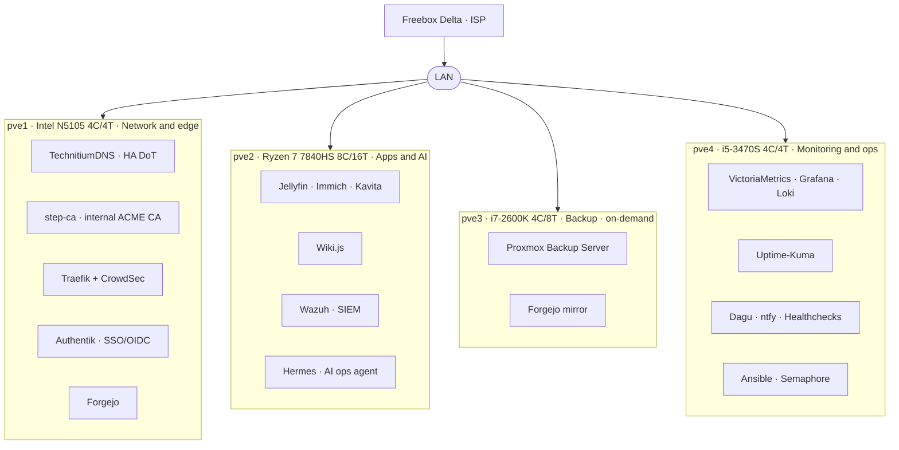

# homelab-public

> Architecture and design notes for a fully self-hosted homelab — **4 Proxmox nodes, 59 LXC containers, not a single paid cloud service.**

This repository documents *how* the homelab is built and *why* each component was chosen. No secrets, no internal addresses — just the architecture, the trade-offs, and the reasoning. The infrastructure itself runs privately; this is the public design record.

🔗 Live status & metrics: **[pixelium.win](https://pixelium.win)** · **[pixelium.win/infrastructure](https://pixelium.win/infrastructure)**

---

## Topology

Services are distributed by **criticality**: network infrastructure on the most stable node, application services and AI on the most powerful, monitoring on a dedicated node, and backup on an on-demand node that stays powered off (Wake-on-LAN) to save energy.

## Nodes

| Node | Hardware | Role | Key services |
|---|---|---|---|
| **pve1** | Intel N5105 · 4C/4T @ 2 GHz | Network & edge | TechnitiumDNS, Traefik, step-ca, Forgejo, Authentik, Home Assistant |
| **pve2** | Ryzen 7 7840HS · 8C/16T Zen4 | Application & AI | Jellyfin, Immich (GPU ML), Kavita, Wiki.js, Wazuh SIEM, Hermes |
| **pve3** | i7-2600K · 4C/8T | Backup & cold storage *(on-demand)* | Proxmox Backup Server, Forgejo mirror, Samba |
| **pve4** | i5-3470S · 4C/4T | Monitoring & ops | Grafana, VictoriaMetrics, Loki, Uptime-Kuma, Dagu, ntfy, Healthchecks, Semaphore |

## Building blocks — and why

No trendy stacks. Each tool solves a concrete problem. Here is what was chosen, what it replaced, and the result.

| Layer | Choice | Replaced | Result |
|---|---|---|---|
| **Hypervisor** | Proxmox VE (native LXC) | ESXi (paid), Hyper-V, XCP-ng | Containers boot in 2 s / ~50 MB RAM, integrated PBS, full API |
| **Reverse proxy** | Traefik + CrowdSec | NPM (UI-only), Caddy | HTTPS by dropping a YAML file, hot-reload, native ACME |
| **DNS** | TechnitiumDNS | Pi-hole (no DoT), AdGuard Home | HA DNS (AXFR primary/secondary), ~650k blocked domains, strict DoT |
| **Internal PKI** | step-ca (private ACME) | mkcert (manual), Vault PKI (overkill) | Full internal PKI, zero browser warnings, auto-renewed 90-day certs |
| **SSO** | Authentik (OIDC + forward-auth) | Keycloak (heavy), Authelia | Single login across heterogeneous services, WebAuthn MFA |
| **Config mgmt** | Ansible + Semaphore | Puppet/Chef (agents), Terraform | Agentless, idempotent, one-command agent rollout across 65 hosts |
| **SIEM** | Wazuh | ELK (no native SIEM), Splunk (commercial) | FIM, CIS compliance, intrusion detection in one product |
| **IPS** | CrowdSec | Fail2ban (local-only) | Community blocklists, iptables bouncer on Traefik |
| **Metrics** | VictoriaMetrics | Prometheus (heavier), InfluxDB | Single-binary PromQL TSDB, superior compression, 20+ targets |
| **System mon.** | Beszel | Grafana + node_exporter | 10 MB Go agents, one-command install, instant CPU/RAM/disk overview |
| **Patch compliance** | Patchmon | manual `apt list --upgradable` | Centralized pending-update dashboard across all CTs |

## Security posture

- **Edge** — Traefik terminates TLS, CrowdSec IPS bouncer drops malicious IPs (community blocklists)
- **Identity** — Authentik SSO/OIDC, WebAuthn (hardware key) MFA, forward-auth for SSO-less services
- **PKI** — step-ca internal ACME, 90-day certificates, zero manual renewal
- **DNS** — DNS-over-TLS enforced on all clients, OISD + Hagezi blocklists
- **Detection** — Wazuh SIEM (FIM + CIS compliance), CrowdSec scenarios, centralized logs in Loki
- **Backup** — Proxmox Backup Server (incremental, deduplicated) on an air-gapped-by-default on-demand node

## Operations

AI is kept where it adds judgment, plain automation where work repeats:

- **Hermes** (NousResearch agent, MiniMax M3) — Telegram correspondent, self-improving, runs doc-reconciliation and tech-watch cron chains
- **Dagu** — scheduled ops DAGs (backups, audits, metrics push)
- **Native alerting** — Beszel / Wazuh / CrowdSec → ntfy, no agent middleman

---

*This is documentation only. The running infrastructure, its configurations, and its secrets are private. Live figures on [pixelium.win](https://pixelium.win) are pushed every 15 minutes from the cluster — the [interactive topology map](https://pixelium.win/infrastructure) (73 nodes) is generated straight from the Proxmox API, not hand-drawn.*
